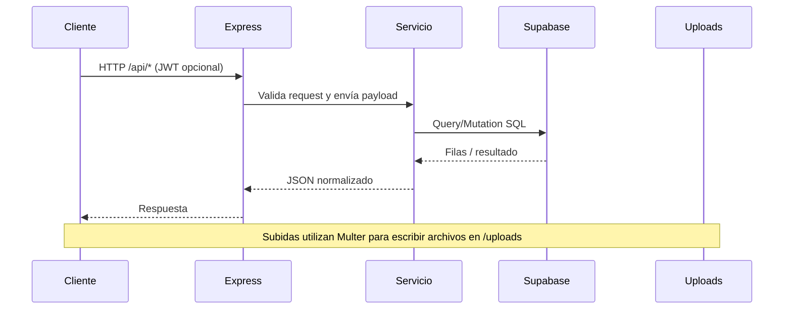

# Referencia del Backend (Express + Supabase)

El backend es un servicio Node.js/Express que expone endpoints REST, sirve la SPA en producción y sincroniza datos con Supabase Postgres mientras guarda los binarios en disco (`backend/uploads/`).

## Stack y flujo de arranque
- Node.js 20, Express 4
- Supabase Postgres (driver `pg`)
- JWT (HS256) para sesiones
- Multer para manejar archivos

## Guía de archivos
| Archivo | Rol |
| --- | --- |
| `src/server.js` | Configura Express, CORS, rate limiting, JSON, rutas `/api`, `/uploads` y fallback a la SPA. |
| `src/config/database.js` | Conecta con Supabase y llama a `ensureAdminUser`. |
| `src/db/pool.js` | Crea el pool compartido (`Pool` de `pg`). |
| `src/middleware/auth.js` | Verifica JWT, adjunta `req.user` y expone `adminAuth`. |
| `src/middleware/upload.js` | Define almacenamiento Multer, límites y filtros. |
| `src/utils/mappers.js` | Convierte filas SQL en estructuras camelCase + snake_case para compatibilidad. |
| `src/routes/*.js` | Rutas REST para auth, categorías, nominados, votos y media. |
| `src/services/*.js` | Lógica de negocio + SQL por dominio. |

## Detalle por servicio
- **Usuarios (`services/users.js`)** – Búsqueda, creación con bcrypt, validación de credenciales y seeding del admin.
- **Categorías (`services/categories.js`)** – Lectura (con contadores de nominados/votos), creación/edición y control de `max_nominees`.
- **Nominados (`services/nominees.js`)** – CRUD completo, vinculación a media aprobada y eliminación cascada de votos.
- **Votos (`services/votes.js`)** – Registro con IP/User-Agent, restricción única por categoría y agregados para resultados.
- **Media (`services/media.js`)** – Inserción/listado de uploads, revisión, borrado del usuario y borrado admin (`deleteMediaAsAdmin`).

## Rutas principales
| Router | Endpoint base | Comentarios |
| --- | --- | --- |
| `routes/auth.js` | `/api/auth` | Registro, login, perfil y logout. |
| `routes/categories.js` | `/api/categories` | CRUD con validación; GET incluye nominados + votos. |
| `routes/nominees.js` | `/api/nominees` | Listado público y CRUD admin. |
| `routes/votes.js` | `/api/votes` | Emitir voto, ver votos propios, ver resultados y eliminar votos. |
| `routes/media.js` | `/api/media` | Subir, listar, revisar, servir y eliminar media (usuarios + admins). |

## Esquema Supabase (`supabase/schema.sql`)
- `users` – Campos `username`, `email`, `password_hash`, `role`, `is_active` + triggers de `updated_at`.
- `categories` – Metadatos de votación (`max_nominees`, `allow_multiple_votes`, `year`, etc.).
- `media_uploads` – Información de archivos, estado, notas y relación con usuarios.
- `nominees` – Datos de candidatos, categoría y media asociada.
- `votes` – Clave única `(user_id, category_id)` más IP/User-Agent.

## Ciclo de una request típica
1. El cliente hace `POST /api/media/upload` con `multipart/form-data`.
2. Multer guarda el archivo en `uploads/` y expone los metadatos en `req.file`.
3. La ruta valida y llama a `createMediaUpload`.
4. El servicio inserta la fila en Postgres y devuelve el registro mapeado.
5. Express responde con JSON, el cliente actualiza la UI y el admin revisa más tarde.

Consulta [docs/env/README.md](docs/env/README.md) para variables de entorno y el diagrama completo en [README.md](README.md).
