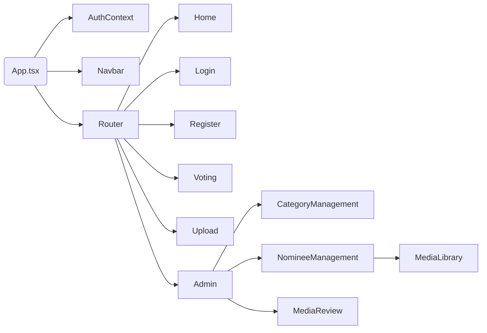

# Referencia del Frontend (React + Material UI)

La SPA está construida con React 19 + TypeScript usando Material UI para la capa visual y Axios para consumir la API. Las rutas se gestionan con React Router y la sesión se maneja mediante `AuthContext`.

## Vista general

## Estructura de archivos
| Archivo | Función |
| --- | --- |
| `src/index.tsx` | Arranca la app, aplica tema MUI y envuelve con `AuthProvider`. |
| `src/App.tsx` | Define rutas, layout y carga de páginas. |
| `src/contexts/AuthContext.tsx` | Guarda token, expone `user`, `isAdmin`, métodos de login/logout. |
| `src/services/api.ts` | Cliente Axios con interceptores y helpers tipados para cada endpoint. |
| `src/types/index.ts` | Interfaces compartidas (User, Category, Nominee, Vote, MediaUpload...). |
| `src/pages/*.tsx` | Pantallas (`Home`, `Login`, `Register`, `Voting`, `Upload`, `Admin`). |
| `src/components/*.tsx` | UI reutilizable (CategoryManagement, NomineeManagement, MediaReview, MediaLibrary, Navbar, LogoNA, etc.). |
| `src/App.css` / `src/index.css` | Estilos globales y resets. |

## Flujo de datos
1. `index.tsx` renderiza `App`. `AuthContext` revisa `localStorage` y opcionalmente consulta `/auth/me`.
2. `App.tsx` monta `BrowserRouter` y decide qué página mostrar; las rutas críticas requieren usuario autenticado.
3. `services/api.ts` añade el JWT automáticamente y expone funciones (`auth`, `categories`, `media`, `votes`, etc.).
4. Las páginas usan `useState`/`useEffect` para traer datos y renderizar componentes (ej. `Voting.tsx` pinta acordeones con categorías y maneja selección local). |
5. El panel Admin combina `CategoryManagement`, `NomineeManagement` y `MediaReview` en tabs.
6. `MediaLibrary` y `MediaReview` comparten el mismo helper de `media` para aprobar, rechazar o eliminar archivos.

## Interacciones clave
- **AuthContext ↔ Navbar** – Muestra acciones de login/logout y enlaces para admins.
- **Upload** – Usa Dropzone para elegir archivos, llama `media.upload`, muestra progreso y lista “Mis archivos” con opción de borrar.
- **Voting** – Descarga la estructura de categorías + nominados, envía votos y muestra el estado por categoría.
- **Admin** – Crea/edita categorías (orden, año, flags), gestiona nominados y revisa media pendiente. `NomineeManagement` abre `MediaLibrary` para vincular archivos; ambas vistas permiten borrar media aprobada.

## Extensión
- Nuevos endpoints → agrega helper en `services/api.ts` y actualiza `types`.
- Nuevas páginas → crea archivo en `src/pages`, registra ruta en `App.tsx` y añade enlace en `Navbar` si aplica.
- Componentes reutilizables → `src/components` (mantén estado complejo en páginas o contexts).

Para detalles del backend consulta [BACKEND.md](BACKEND.md). El README principal cubre scripts e instalación.
