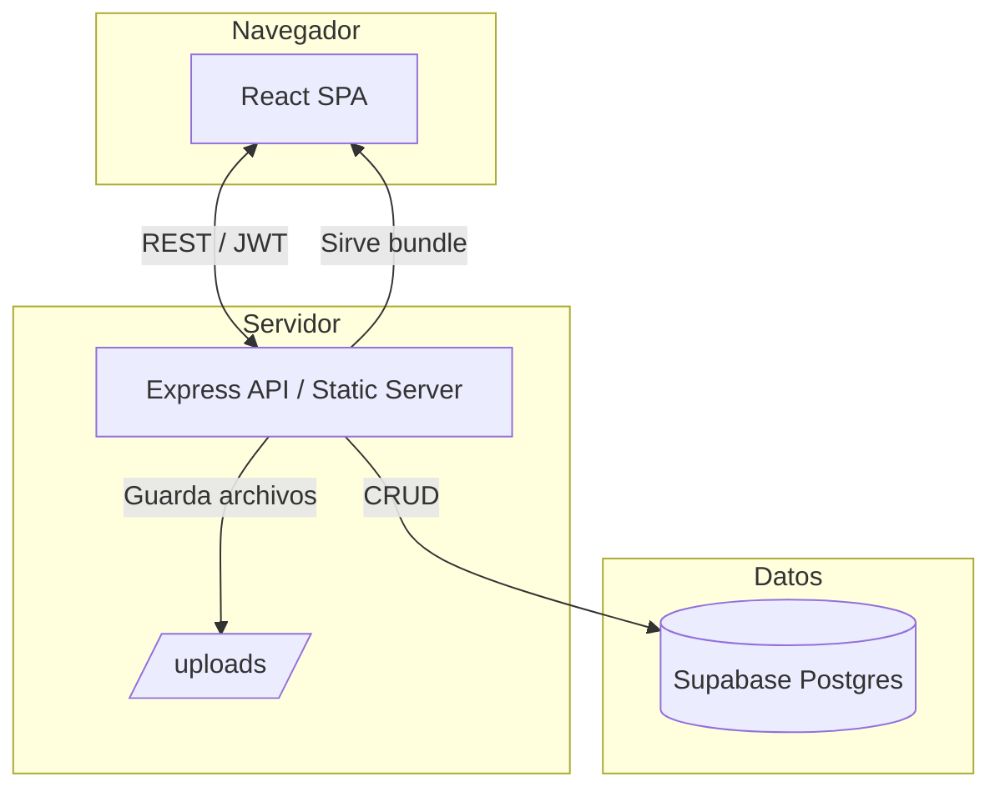

# Plataforma Nordicos Awards

Nordicos Awards es una aplicación web full-stack donde los administradores gestionan categorías y nominados, los invitados suben contenido multimedia y los usuarios autenticados votan por los finalistas. El backend es una API Node.js/Express con Supabase Postgres, mientras que el frontend es una SPA en React + Material UI que también es servida por Express en producción.

## Arquitectura (visión general)



## Estructura del repositorio y responsabilidades

| Ruta | Descripción |
| --- | --- |
| `backend/src/server.js` | Punto de entrada de Express: carga variables, registra middleware, expone `/api/*`, `/uploads` y entrega la SPA compilada. |
| `backend/src/config/database.js` | Crea el pool de Supabase y asegura la existencia del usuario admin inicial. |
| `backend/src/routes/*.js` | Módulos de rutas para auth, categorías, nominados, votos y media. Cada uno valida y delega al servicio correspondiente. |
| `backend/src/services/*.js` | Capa de acceso a datos con SQL para usuarios, categorías, nominados, votos y uploads. |
| `backend/src/middleware/*.js` | Middleware de JWT y pipeline de subida con Multer. |
| `backend/src/utils/mappers.js` | Convierte filas SQL en respuestas camelCase (mantiene snake_case heredado para la SPA). |
| `frontend/src/App.tsx` | Cascarón de la SPA: define rutas, tema y layout. |
| `frontend/src/pages/*.tsx` | Pantallas principales (`Home`, `Login`, `Register`, `Voting`, `Upload`, `Admin`). |
| `frontend/src/components/*.tsx` | Componentes reutilizables (CategoryManagement, NomineeManagement, MediaReview, MediaLibrary, Navbar, etc.). |
| `frontend/src/contexts/AuthContext.tsx` | Persiste el JWT, maneja login/logout y habilita controles para admins. |
| `frontend/src/services/api.ts` | Cliente Axios con helpers tipados para todos los endpoints REST. |
| `supabase/schema.sql` | DDL canónico para usuarios, categorías, media uploads, nominados y votos (con triggers y constraints). |
| `deploy/` | Notas de despliegue y scripts Mongo heredados (solo referencia histórica). |
| `docs/` | Documentación de arquitectura, riesgos, entornos, etc. |

> 📚 Para más detalle consulta [BACKEND.md](BACKEND.md) y [FRONTEND.md](FRONTEND.md).

## ¿Cómo funciona la app?

1. **Autenticación** – Los usuarios se registran/inician sesión vía `/api/auth/*`. El JWT queda en `localStorage` y se envía automáticamente en cada request.
2. **Subida de media** – En `/upload`, los usuarios autenticados suben archivos. Los binarios van a `uploads/` y los metadatos a Postgres. Los administradores los revisan desde el panel.
3. **Gestión del catálogo** – En la sección Admin, se crean categorías y nominados mediante los componentes `CategoryManagement` y `NomineeManagement` (rutas `/api/categories` y `/api/nominees`).
4. **Votaciones** – En `/voting`, los usuarios emiten un voto por categoría (a menos que se permitan múltiples). El backend aplica la restricción con una unique constraint en DB.
5. **Revisión / biblioteca** – La media aprobada aparece en `MediaLibrary` cuando los admins vinculan archivos a nominados. Desde ahí también pueden eliminar material pendiente o aprobado.

## Puesta en marcha

### Requisitos
- Node.js 20+ y npm 10+
- Instancia Supabase (o cualquier Postgres) para `SUPABASE_DB_URL`

### Instalación
```bash
npm install
cp .env.example .env                     # completa SUPABASE_DB_URL, JWT_SECRET y credenciales admin
psql "$SUPABASE_DB_URL" -f supabase/schema.sql   # o ejecuta el SQL en el editor de Supabase
npm run dev                              # levanta backend + CRA dev server
```

### Scripts útiles
| Comando | Descripción |
| --- | --- |
| `npm run dev` | Ejecuta backend (`npm:dev:backend`) y frontend (`npm:dev:frontend`) en paralelo. |
| `npm run build` | Compila la SPA de React (correr antes de `npm start` en producción). |
| `npm start` | Inicia la API Express y sirve la SPA construida (requiere conexión válida a Supabase). |
| `npm run deploy` | Atajo: `npm run build && npm start`. |

## Flujos clave y archivos
- **Autenticación** – `backend/src/routes/auth.js`, `backend/src/services/users.js`, `frontend/src/contexts/AuthContext.tsx`, `frontend/src/pages/Login.tsx`, `Register.tsx`.
- **Media (subida/revisión)** – `backend/src/routes/media.js`, `backend/src/services/media.js`, `frontend/src/pages/Upload.tsx`, `frontend/src/components/MediaReview.tsx`, `MediaLibrary.tsx`.
- **Categorías/Nominados** – `backend/src/routes/categories.js`, `backend/src/routes/nominees.js`, `frontend/src/components/CategoryManagement.tsx`, `NomineeManagement.tsx`.
- **Votaciones** – `backend/src/routes/votes.js`, `backend/src/services/votes.js`, `frontend/src/pages/Voting.tsx`.

## Documentación relacionada
- [BACKEND.md](BACKEND.md) – Detalle de rutas/servicios, esquema Supabase y diagrama de flujo.
- [FRONTEND.md](FRONTEND.md) – Arquitectura de la SPA, responsabilidades por componente y flujo de datos.
- [docs/](docs/) – Plan de merge, registro de riesgos, guía de entornos, etc.
